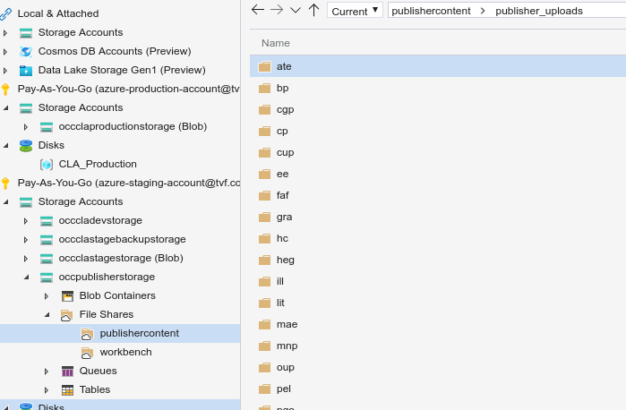

# Publisher FTP

OCC have set up several Azure services to basically act as an FTP server so that publishers may upload PDFs and XML metadata.

## Azure services

The services are all in the Staging Azure environment.

The following services are relevant:

- occclapublisherftp
	- This is the Virtual Machine that actually runs the FTP/FTPS daemon.
	- SFTP is not currently supported - only FTP and FTPS.
- occpublisherstorage
	- This is an Azure Storage account to which files are actually uploaded.

## Details

- Each publisher has their own FTP account (username and password) - one account per publisher.
- The `occpublisherstorage` Storage account contains a File Share called 'publishercontent'.
	- This File Share is mounted as an SMB 3 networked drive on the `occclapublisherftp` machine at `/mnt/azure_publisher_file_share`.
	- Since this is mounted automatically at boot-time, the Storage Accounts authentication credentials are stored here: `/etc/azure_publisher_file_share.smbcredentials`
		- Ensure this file is only ever readable or writable by root.
- Each publisher has their own folder within the File Share:

- Each publisher's FTP credentials chroot them to their own directory - they can't even see other directories.
- The `occclapublisherftp` VM has a static IP address: 51.104.209.100
	- You can SSH in with the username 'smallaev' or 'akazim'.
	- Both users have sudo privileges.
- A few subdomains also point to the `occclapublisherftp` server:
	- publisher-ftp.stage-schoolingplatform.com (preferred)
	- cla-ftp.tvf.uk (fallback)
- SSL certificates for both subdomains is handled by LetsEncrypt installed within the VM. There are no Azure-managed SSL certificates here.
- CLA are currently unable to create publisher accounts themselves. OCC have to create new accounts. Instructions below.
- FTP/FTPS instructions for publishers are also supplied below.

## How to create/update publisher accounts

Instructions to add a new user;

	$ sudo mkdir /mnt/azure_publisher_file_share/publisher_uploads/$USER
	$ sudo ftpasswd --sha512 --passwd --file /etc/proftpd/ftp.users --shell /bin/false --uid 109 --gid 115 --gecos '$FULL_NAME' --name $USER --home /mnt/azure_publisher_file_share/publisher_uploads/$USER

You can repeat the second command to update a password later.

`$USER` is the username for the publisher - a two- or three-character lowercase abbreviation (e.g. 'pgo' for PG Online Ltd, 'oup' for Oxford University Press, 'hc' for Harper Collins, etc.)

`$FULL_NAME` is the publisher's actual name (PG Online Ltd, Oxford University Press, Harper Collins, etc.).

Make sure you test the account by following the instructions below before forwarding on the credentials - upload a file and then delete it.

Alternatively you may use the script at `scripts/publisher_ftp_credential_creator`, which automates the process.

## FTP/FTPS instructions for publishers

1. Download and install the FileZilla Client from https://filezilla-project.org/

2. Run FileZilla.

3. In the Quick Connect bar at the top of the window, enter "cla-ftp.tvf.uk" in the "Host" field, and your username and password in the two adjacent boxes. Leave the "Port" box blank.

4. Click the "Quickconnect" button.

5. Click "OK" when asked to verify the server's certificate.

6. The process for transferring files is described here: https://wiki.filezilla-project.org/FileZilla_Client_Tutorial_(en)