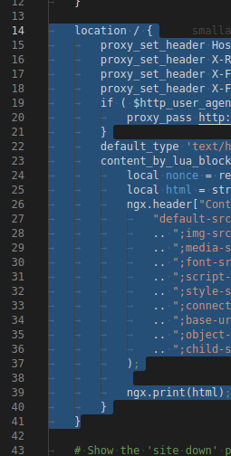
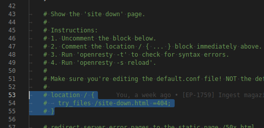

The Education Platform has a 'site down for maintenance' page that can be displayed if the website needs to be down for an extended period of time.

## Show the 'site down' page

You can display the 'site down' page as follows:

1. Initialize an SSH tunnel to the Production PublicWebApp:

	$ az webapp create-remote-connection --resource-group CLA_Production -n cla-production-public-web-app

If you get a message like `'cla-production-public-web-app' app doesn't exist` then execute `az login` and login to the Production Azure Portal. Credentials are in the TVF passwords document.

See `documentation/azure_ssh/README.md` for more information on how to open SSH tunnels.

2. SSH into the Production PublicWebApp via the tunnel initialized in (1):

	$ ssh root@127.0.0.1 -p <PORT>

`<PORT>` is the port displayed after completing (1). See `documentation/azure_ssh/README.md` for more details.

3. Open the nginx configuration file:

	$ nano /etc/nginx/conf.d/default.conf

4. Comment out the main nginx location block by prepending `#` at the beginning of every line.

5. Uncomment out the 'site down' location block be removing the `#` characters at the beginning of the relevant lines.

6. Save the file.

7. Run `openresty -t` and make sure no errors are reported.

8. Restart the server by running `openresty -s reload`.

The 'site down' page now displays on all pages.

## Hide the 'site down' page

1. Initialize an SSH tunnel to the Production PublicWebApp:

2. SSH into the Production PublicWebApp via the tunnel initialized in (1):

3. Open the nginx configuration file:

4. Comment out the 'site down' nginx location block by prepending `#` at the beginning of every line.

5. Uncomment out the main location block be removing the `#` characters at the beginning of the relevant lines.

6. Save the file.

7. Run `openresty -t` and make sure no errors are reported.

8. Restart the server by running `openresty -s reload`.
