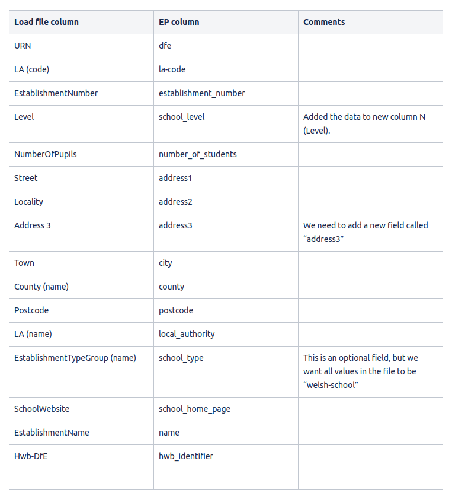

# Hwb School Upsert

NodeJS-based command line tool to upsert Hwb schools from a XLSX file into the database.

Only handles creating schools - does not create users.

Schools are UPSERTED based on hwb_identifier or dfe. If a school already exists with the given hwb_identifier or dfe, that school will be updated.

This is intended purely for JIRA ticket EP-1928 - i.e. loading Hwb schools into the platform so users can sign in via Hwb. Once this ticket has been released to production in April 2021, this directory may be safely deleted.

## Running

	$ node index.js

You will be prompted to enter the path to a XLSX file, as well as the credentials to the database.

The XLSX file should be in the format described in JIRA ticket EP-1928. For reference, the column mapping is pasted below.

